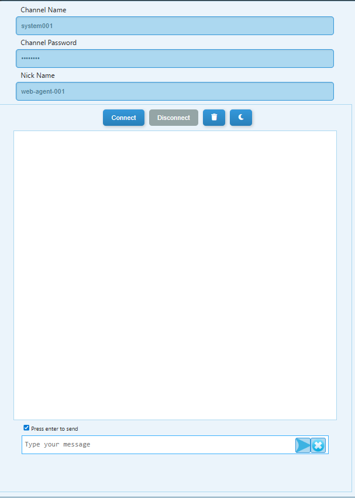
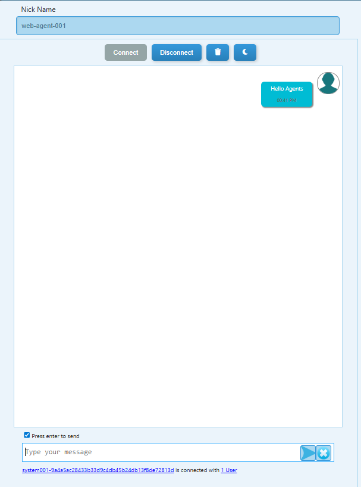
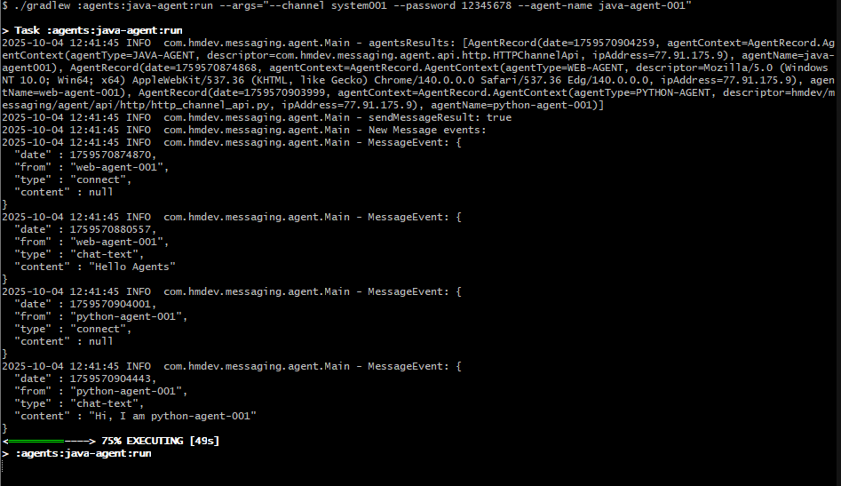
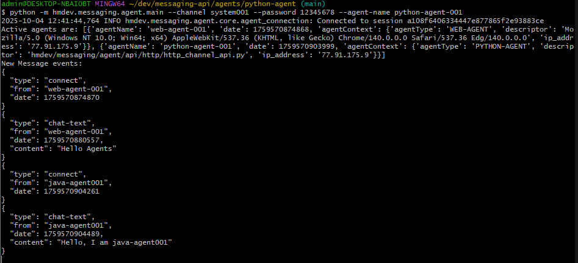
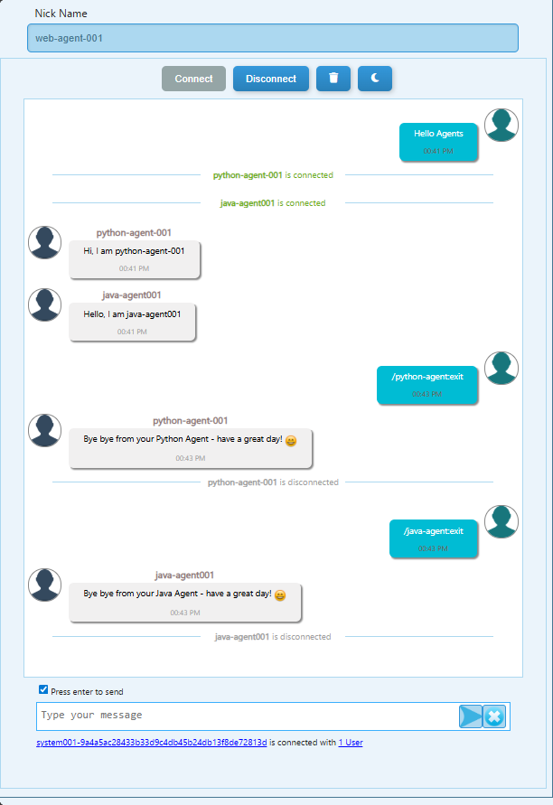
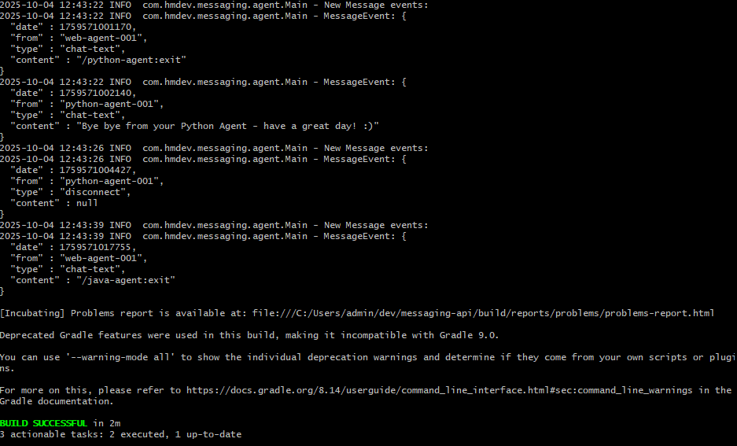
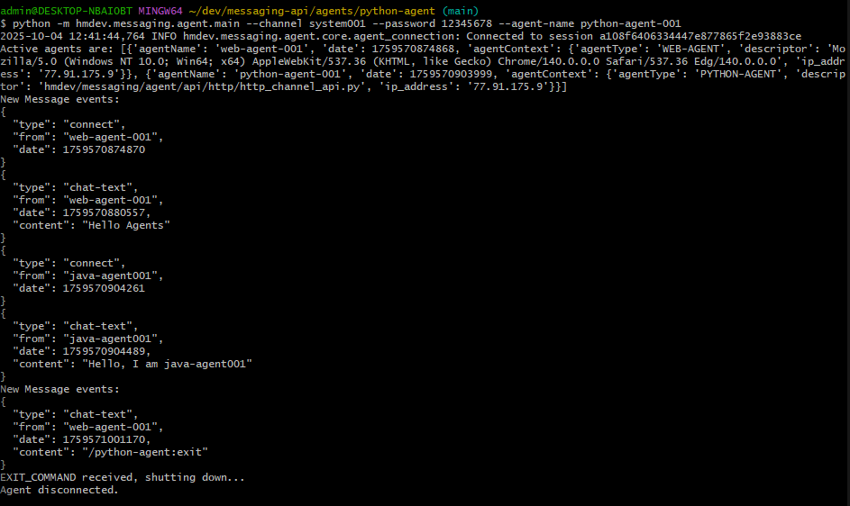

# 🤖 Demo Interaction: Web ↔ Java ↔ Python Agents

This demonstration shows secure multi-agent communication using the **Messaging API**.
All messages are **end-to-end encrypted** — the Origin Service only relays ciphertext and cannot decrypt message contents.

---

## 🟩 Step 1 — Web Agent connects

1. Open the Web Agent UI (`/messaging-platform/web-agent/index.html`).

> Note: The Web Agent UI has been visually enhanced but follows the same concepts shown in this demo. The updated UI includes an input for an API key / API key ID (in addition to channel name/password) to support POC and production-style workflows — you can provide an API key instead of a channel password when appropriate.

2. Enter:
   - **Channel Name:** `system001`
   - **Channel Password:** `12345678`
   - **Nick Name:** `web-agent-001`
3. Click **Connect** → sends:
   ```
   Hello Agents
   ```

📸 *Web Agent Initial Connection*



📸 *Web Agent Says Hello*



---

## 🟨 Step 2 — Java & Python Agents connect

Run the agents using their command-line interfaces.

### Java Agent
```bash
./gradlew :agents:examples:java-agent-chat:run --args="--channel system001 --password 12345678 --agent-name java-agent001"
```

📸 *Java Agent Connection and Message*


### Python Agent
```bash
python agents/examples/python-agent-chat/chat_example.py --channel system001 --password 12345678 --agent-name python-agent-001
```

📸 *Python Agent Connection and Message*


📝 **Note:**
Both **Java** and **Python** agents automatically send initial messages (`"Hello, I am <agent>"`)
based on their sample `main` code in the project.

---

## 🟥 Step 3 — Web Agent commands Java Agent to exit

- Web Agent sends:
  ```
  /java-agent:exit
  ```
- Java Agent responds:
  ```
  Bye bye from your Java Agent — have a great day! :)
  ```
- Then disconnects gracefully.

📸 *Web Agent Commands Exit*



📸 *Java Agent Exit Message*



---

## 🟦 Step 4 — Web Agent commands Python Agent to exit

- Web Agent sends:
  ```
  /python-agent:exit
  ```
- Python Agent responds:
  ```
  Bye bye from your Python Agent — have a great day! :)
  ```
- Then disconnects gracefully.

📸 *Python Agent Exit*



---

## ✅ Result

- The Web Agent coordinated **graceful shutdowns** of both Java and Python agents.
- Each agent confirmed exit securely and disconnected.
- The Origin Service simply relayed encrypted events without knowing message content.

---

## ⚙️ Notes

- Agents use the same **channel name and password** to derive the shared encryption key.
- Messages remain fully encrypted (AES-CTR with PBKDF2 key derivation).
- The system supports bidirectional, multi-agent communication securely.

---
