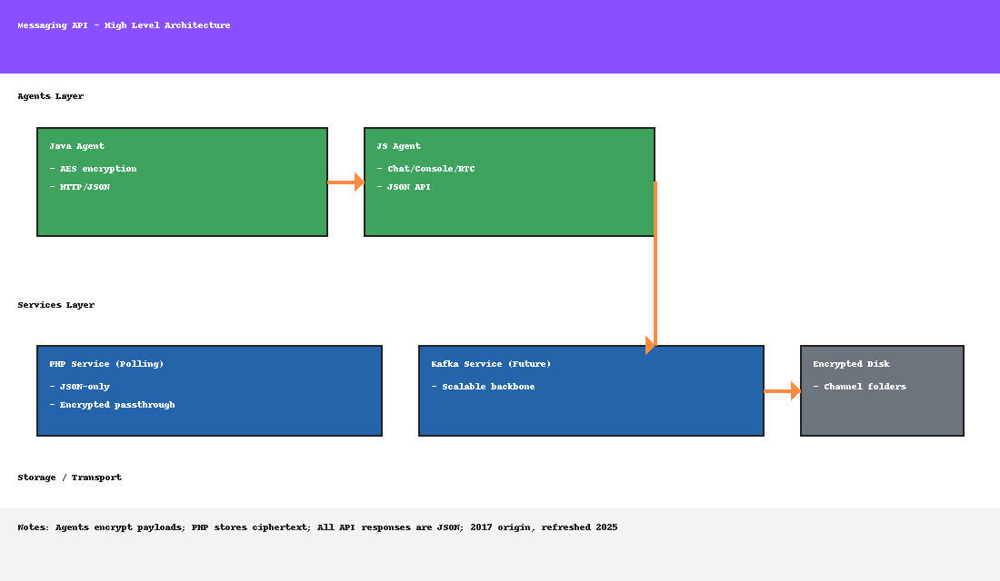

# messaging-api

Lightweight messaging API for chat, IoT, and cross-language apps.

This project started in 2017 as a PHP polling relay and is now refreshed with agents, JSON APIs, and a roadmap toward Kafka.



```
ASCII fallback

Agents (Java / JS)  =>  Services (PHP Polling, Kafka Future)  =>  Encrypted Storage
       |                              ^                                   |
       +---------- JSON over HTTP ----+-------------------- ciphertext ----+
```
